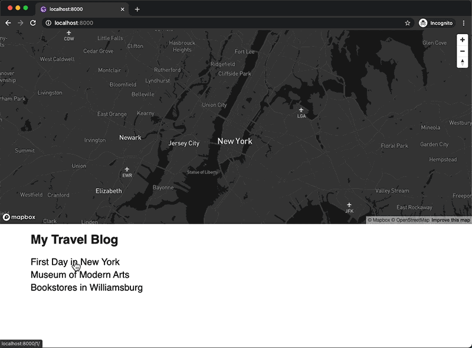

# Gatsby + Mapbox GL JS Blog

Demo website:
https://erraticgenerator.github.io/gatsby-mapbox-blog/

This is a bare minimum structure that uses Gatsbyjs + Mapbox GL JS + React hooks.

- Removed most of the codes/components/styling to focus on the main task. (no SEO, header, image handling, etc.)
- Uses Markdown frontmatter to add markers on the map. Only basic implementation with manual coordinate setup, but you can implement Mapbox Geocoding API to automate the process.
- `Layout` component uses `wrapPageElement` browser API so that the map will not reload on every page load. Only the markers will update.
- Using Turf.js to get the bounding box of the markers.
- Seamless transition animation between blog posts because the Map component only loads once.

Read my process on:
...

Or on Medium:
...

